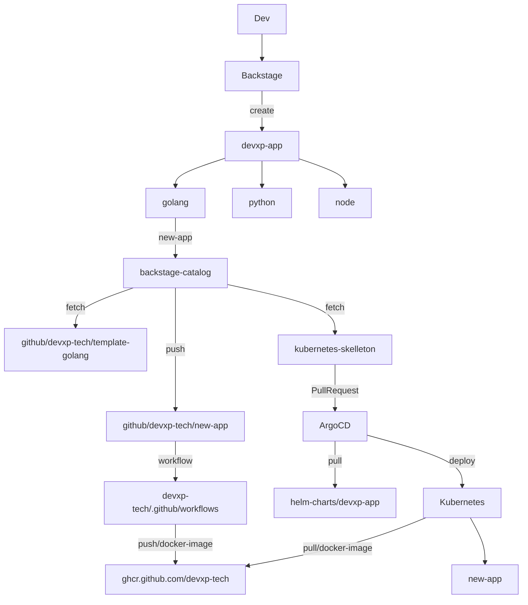

# Backstage

[](https://github.com/devxp-tech/backstage/actions/workflows/main.yaml)
[](https://sonar.diegoluisi.eti.br/dashboard?id=backstage)
[](https://argocd.diegoluisi.eti.br/applications/backstage-prd)

## Backstage - IDP

## Environments you need before start

| Name                      | Where to get?                                                                                                   |
| :------------------------ | :-------------------------------------------------------------------------------------------------------------- |
| GITHUB_ACCESS_TOKEN       | Generate a new personal access token in [GIthub Secure page](https://github.com/settings/tokens)                |
| AUTH_GITHUB_CLIENT_ID     | Get in [Github app ID](https://github.com/organizations/devxp-tech/settings/applications/1927877)             |
| AUTH_GITHUB_CLIENT_SECRET | Open a tiket to Devxp to share this value                                                                       |
| SONARQUBE_TOKEN           | Create a `Sonarqube` token using this [documentation](https://docs.sonarqube.org/latest/user-guide/user-token/) |

All environments above `MUST` be exported in your bash context like below:

```sh
# .bashrc or .zshrc
export GITHUB_ACCESS_TOKEN='YOUR-TOKEN-HERE'
export AUTH_GITHUB_CLIENT_ID='YOUR-TOKEN-HERE'
export AUTH_GITHUB_CLIENT_SECRET='YOUR-TOKEN-HERE'
export SONARQUBE_TOKEN='YOUR-TOKEN-HERE'
```

## Setup your hosts

You'll need to create an entry to your `/etc/hosts` to specify `backstage.local` like below:

```sh
# /etc/hosts

# ...
127.0.0.1 backstage.local
#...

```

## 🚀 Start project

You'll need `Docker` and `docker-compose` installed before you continue!

Once all you need is in your bash context, just run the commands below:

```sh
docker-compose run --rm app yarn # to install node_modules
docker-compose up -d app # to up the backstage application
```

Backstage in develop mode will be available in <http://backstage.local:3000> and it's using `GitHub SSO integration`

## 🆙 Backstage Update

```sh
docker-compose run --rm app bash
yarn backstage-cli versions:bump
```

## 🚦 Work Flux



## 🧩 References 

- [ArgoCD](https://github.com/devxp-tech/gitops)
- [helm-charts](https://github.com/devxp-tech/helm-charts)
- [Backstage](https://github.com/devxp-tech/backstage)
- [backstage-catalog:](https://github.com/devxp-tech/backstage-catalog)
- [template-golang](https://github.com/devxp-tech/template-golang)
- [github-workflows](https://github.com/devxp-tech/.github)


## ✨ Contributions

We ❤️ contributions big or small. [See our guide](contributing.md) on how to get started.

### Thanks to all our contributors!

<a href="https://github.com/devxp-tech/backstage/graphs/contributors">
  
</a>

Made with 💜 by DevXP-Tech.
